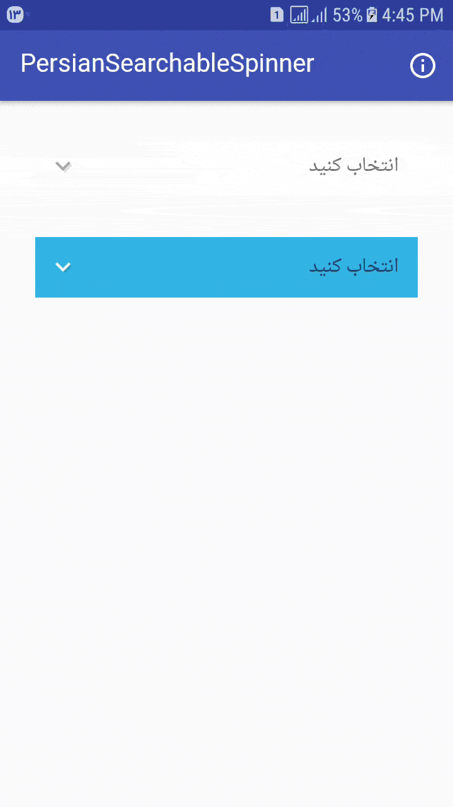

# PersianDateRangePicker
[](https://jitpack.io/#bkhezry/PersianDateRangePicker)

Custom Spinner element with searchable.

**Project Setup and Dependencies**
- JDK 8
- Android SDK Build tools 27.0.3
- Supports API Level +17
- AppCompat & Design libraries 27.1.1

## A quick overview
- compatible with **API Level +17**
- **RTL** support
- **Custom Font** support

# Preview
## Demo
You can download the latest demo APK from here: https://github.com/bkhezry/PersianDateRangePicker/blob/master/assets/PersianDateRangePicker.apk

## Screenshots


# Setup
## 1. Provide the gradle dependency
Add it in your root build.gradle at the end of repositories:
```gradle
allprojects {
	repositories {
		...
		maven { url "https://jitpack.io" }
	}
}
```
Add the dependency:
```gradle
dependencies {
implementation 'com.github.bkhezry:PersianSearchableSpinner:1.4.0'
}
```
Using the Spinner
--------------------------------

# Credits

- searchablespinner- [GitHub](https://github.com/michaelprimez/searchablespinner)

# Developed By

* Behrouz Khezry
 * [@bkhezry](https://twitter.com/bkhezry) 


# License

    Copyright 2018 Behrouz Khezry

    Licensed under the Apache License, Version 2.0 (the "License");
    you may not use this file except in compliance with the License.
    You may obtain a copy of the License at

       http://www.apache.org/licenses/LICENSE-2.0

    Unless required by applicable law or agreed to in writing, software
    distributed under the License is distributed on an "AS IS" BASIS,
    WITHOUT WARRANTIES OR CONDITIONS OF ANY KIND, either express or implied.
    See the License for the specific language governing permissions and
    limitations under the License.
